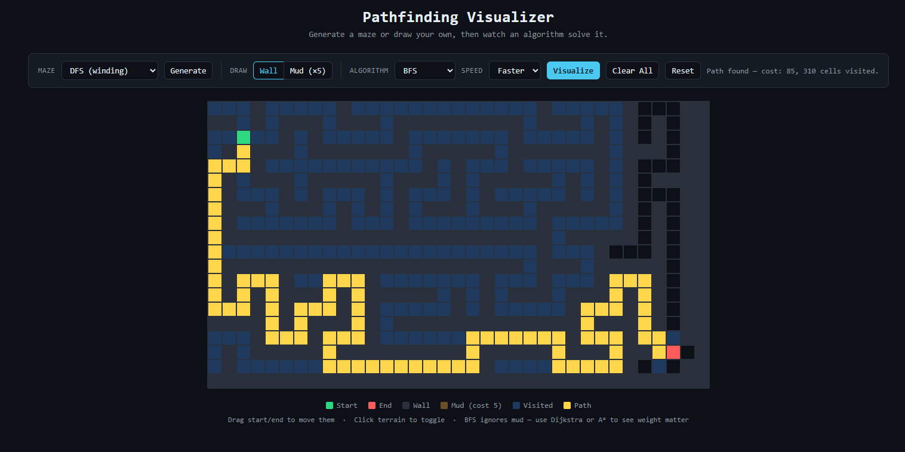

# Pathfinding Visualizer

A full stack pathfinding algorithm visualizer built with **FastAPI** (backend) and **plain HTML/CSS/JavaScript** (frontend). Watch BFS, DFS, Dijkstra, and A* search a grid in real time — or generate a maze first and let the algorithm find its way through.


---

## Features

**Pathfinding algorithms**
- **Breadth-First Search** — guarantees shortest path on an unweighted grid
- **Depth-First Search** — explores deep before backtracking; does not guarantee shortest path
- **Dijkstra's Algorithm** — shortest path on a weighted grid; accounts for terrain cost
- **A\* Search** — Dijkstra plus a Manhattan distance heuristic; visits fewer cells while still guaranteeing the shortest path

**Weighted terrain**
- Place "mud" cells (cost ×5) to make terrain expensive to cross
- BFS ignores weights and charges straight through; Dijkstra and A\* route around mud when it's cheaper to do so — making the difference between weighted and unweighted search visible

**Maze generation**
- **Randomized DFS** — carves winding corridors through a grid filled with walls; every generated maze has exactly one solution
- **Recursive Division** — starts open and subdivides chambers with walls and doorways; produces a grid of interconnected rooms

**Architecture**
- Algorithms run as Python generators on the backend, yielding one step at a time
- Steps stream to the frontend over **WebSocket** connections in real time — the backend drives the animation, not a client-side replay loop
- A REST `/solve` fallback is available if WebSocket fails
- **Stop button** closes the WebSocket mid-run and clears the grid instantly

---

## Project structure

```
algo-visualizer/
  backend/
    main.py            FastAPI app — pathfinding algorithms, maze generators,
                       /solve REST endpoint, /ws/solve and /ws/maze WebSocket endpoints
    requirements.txt
  frontend/
    index.html
    style.css
    script.js
```

---

## Running it

**1. Backend**

```bash
cd backend
python3 -m venv venv
source venv/bin/activate      # Windows: venv\Scripts\activate
pip install -r requirements.txt
python3 -m uvicorn main:app --reload --port 8000
```

Verify it's running:
```bash
curl http://localhost:8000/
```

**2. Frontend**

Open `frontend/index.html` directly in a browser (double-click, or use VS Code Live Server). It connects to the backend at `ws://localhost:8000/ws/solve` and `ws://localhost:8000/ws/maze`.

---

## How to use it

- **Draw walls** — click and drag on the grid
- **Draw mud** — switch to Mud mode and click/drag (costs ×5 to cross)
- **Move start/end** — click and drag the green or red cell
- **Generate a maze** — pick DFS or Division from the Maze dropdown and hit Generate; watch it build live, then run a pathfinding algorithm on top
- **Visualize** — pick an algorithm and speed, hit Visualize, watch it search and highlight the final path
- **Stop** — cancels the current run mid-animation
- **Clear All** — removes all walls and mud; **Reset** rebuilds the grid entirely

---

## How it works

### Backend — Python generators

Each algorithm is a generator function that `yield`s one step at a time:

```python
def gen_astar(rows, cols, start, end, wall_set, weights):
    ...
    while pq:
        f, current = heapq.heappop(pq)
        yield {"type": "visited", "cell": list(current)}  # streamed immediately
        ...
    yield {"type": "done", "found": True}
```

The same generator powers both endpoints: the REST endpoint collects all yields into lists and returns them at once; the WebSocket endpoint streams each yield as it's produced, sleeping briefly between steps to control animation speed.

### WebSocket protocol

The frontend opens a WebSocket, sends the grid parameters as JSON, then listens for messages:

```
{"type": "visited", "cell": [r, c]}   — colour this cell as explored
{"type": "path",    "cell": [r, c]}   — colour this cell as part of the final path
{"type": "done",    "found": bool}    — algorithm finished
```

Maze generation uses the same pattern over `/ws/maze`, with `"wall"` and `"passage"` message types.

### Adding a new algorithm

Register a generator function in the `ALGORITHMS` dict in `main.py` — nothing else needs to change:

```python
ALGORITHMS = {
    "bfs":      ...,
    "dijkstra": ...,
    "astar":    ...,
    "your_algo": lambda rows, cols, start, end, walls, weights: gen_your_algo(...),
}
```

---

## Tech stack

| Layer | Technology |
|---|---|
| Backend | Python, FastAPI, uvicorn |
| Real-time | WebSockets (FastAPI native) |
| Frontend | HTML, CSS, vanilla JavaScript |
| Algorithms | BFS, DFS, Dijkstra, A* (implemented from scratch) |
| Maze generation | Randomized DFS, Recursive Division |
